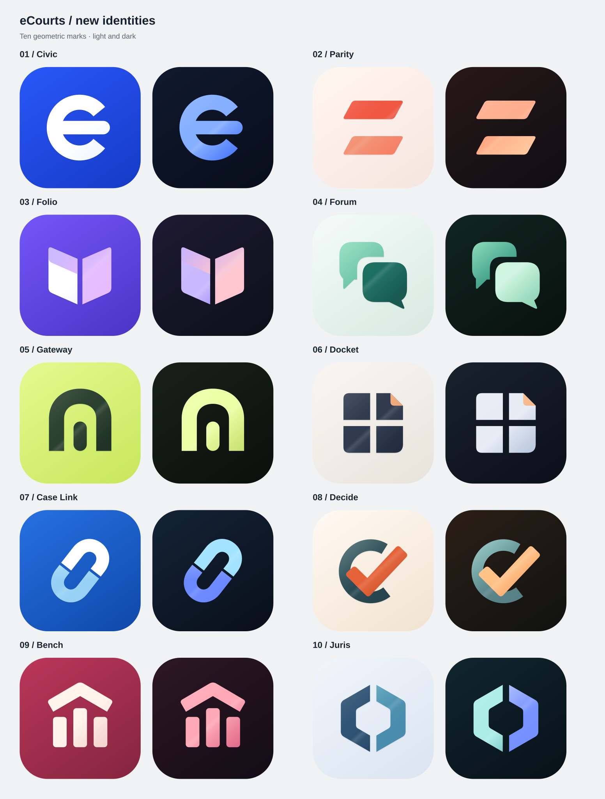

# eCourts app icons

Ten new geometric identities. Every design includes a light icon, a dark icon and a white foreground SVG on transparency.

| Design | Light SVG | Dark SVG | Monochrome SVG |
| --- | --- | --- | --- |
| **Civic** — A custom e with an open circular silhouette. | [Light](icons/01-civic/light.svg) | [Dark](icons/01-civic/dark.svg) | [Foreground](icons/01-civic/mono.svg) |
| **Parity** — Two equal bars with opposing diagonal cuts. | [Light](icons/02-parity/light.svg) | [Dark](icons/02-parity/dark.svg) | [Foreground](icons/02-parity/mono.svg) |
| **Folio** — An open record expressed as two folded planes. | [Light](icons/03-folio/light.svg) | [Dark](icons/03-folio/dark.svg) | [Foreground](icons/03-folio/mono.svg) |
| **Forum** — Two voices with a clear space between them. | [Light](icons/04-forum/light.svg) | [Dark](icons/04-forum/dark.svg) | [Foreground](icons/04-forum/mono.svg) |
| **Gateway** — A broad arch and a central column form one mark. | [Light](icons/05-gateway/light.svg) | [Dark](icons/05-gateway/dark.svg) | [Foreground](icons/05-gateway/mono.svg) |
| **Docket** — A four-part case index with a folded corner. | [Light](icons/06-docket/light.svg) | [Dark](icons/06-docket/dark.svg) | [Foreground](icons/06-docket/mono.svg) |
| **Case Link** — Two open links connect a case and its history. | [Light](icons/07-case-link/light.svg) | [Dark](icons/07-case-link/dark.svg) | [Foreground](icons/07-case-link/mono.svg) |
| **Decide** — A decisive stroke breaks through an open circle. | [Light](icons/08-decide/light.svg) | [Dark](icons/08-decide/dark.svg) | [Foreground](icons/08-decide/mono.svg) |
| **Bench** — A roof and three pillars reduced to bold geometry. | [Light](icons/09-bench/light.svg) | [Dark](icons/09-bench/dark.svg) | [Foreground](icons/09-bench/mono.svg) |
| **Juris** — Two court brackets create a shared hexagonal space. | [Light](icons/10-juris/light.svg) | [Dark](icons/10-juris/dark.svg) | [Foreground](icons/10-juris/mono.svg) |

## Use

- All source icons have a 1024 × 1024 viewBox and editable vector paths.
- Light and dark files have a full square background. Rounded corners appear only in the preview; the launcher applies its own mask.
- The monochrome file contains the foreground only, with transparent surroundings and open negative spaces.
- There are no embedded PNGs, external images, external fonts, scripts or linked assets in the icons.
- SVG is the source format. Native Android launcher bitmap resources or VectorDrawable XML need a separate export.

[Machine-readable paths](manifest.json) · [Source generator](source/build_modern_icons.py)

Example raw SVG: [Civic, dark](https://raw.githubusercontent.com/WikioApps/cdn/main/ecourts/icons/01-civic/dark.svg). Replace `main` with a commit SHA to pin a CDN URL.

Regenerate from the repository root with `python3 ecourts/source/build_modern_icons.py`. Python standard library only.
