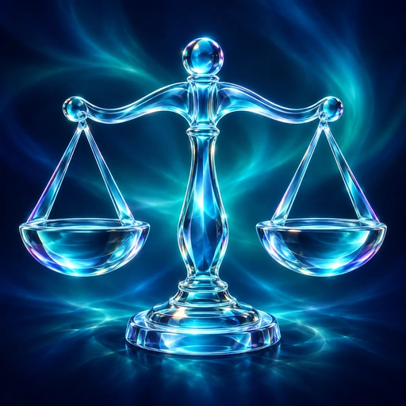
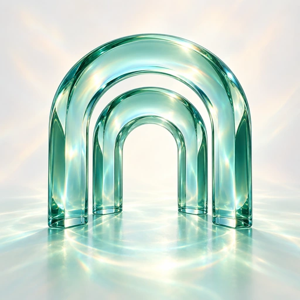
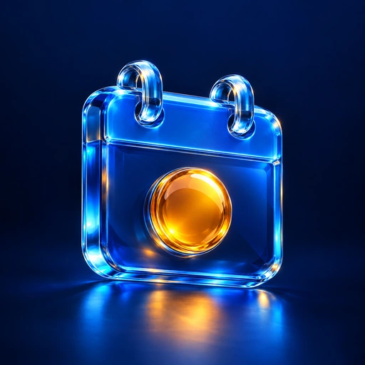
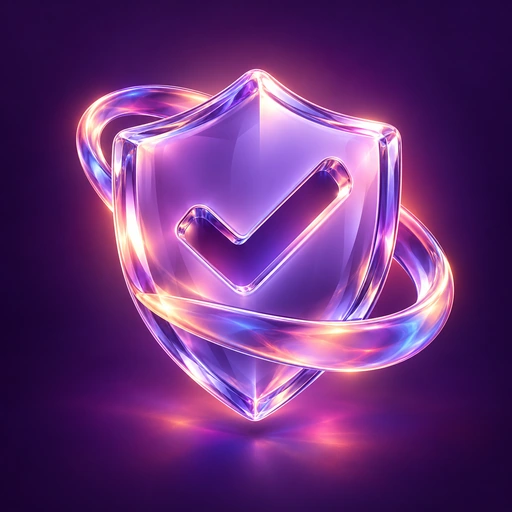
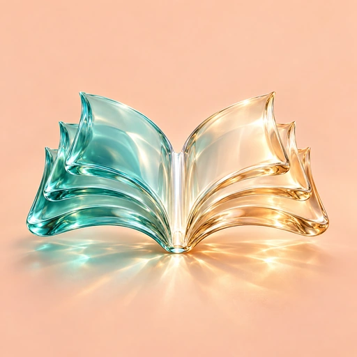
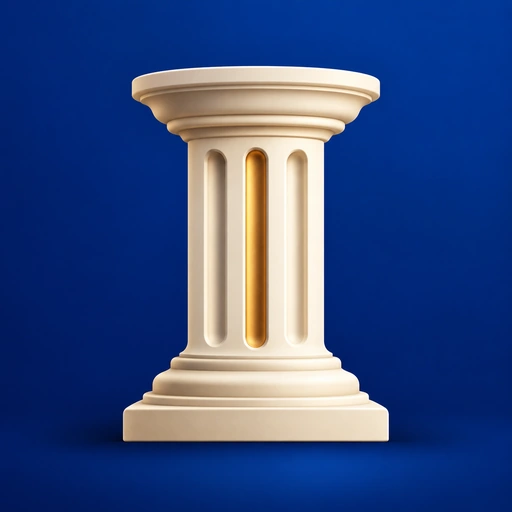
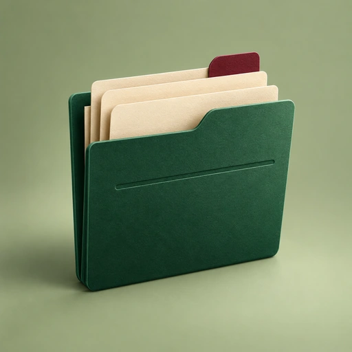
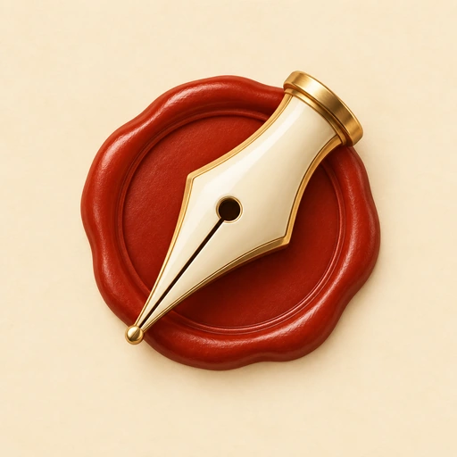
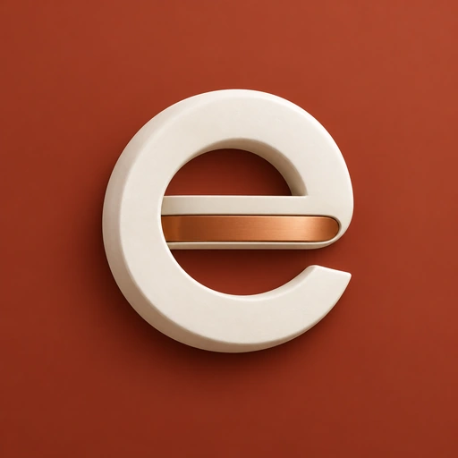

# eCourts icon collection

Ten original icon options, separated by app edition. Each design has a **1024 × 1024 PNG** master and a **512 × 512 WebP** for lightweight delivery. All images are square, opaque raster artwork; corner masks are not baked into the files.

## Liquid glass edition

| Preview | Design | Files |
| --- | --- | --- |
|  | **01 · Prism Balance** Cyan crystal scales on midnight indigo. | [PNG](liquid-glass/icons/01-prism-balance.png) · [WebP](liquid-glass/icons/01-prism-balance.webp) |
|  | **02 · Fluid Portal** Nested aquamarine courthouse arches on pearl. | [PNG](liquid-glass/icons/02-fluid-portal.png) · [WebP](liquid-glass/icons/02-fluid-portal.webp) |
|  | **03 · Hearing Calendar** Sapphire calendar with an amber hearing marker. | [PNG](liquid-glass/icons/03-hearing-calendar.png) · [WebP](liquid-glass/icons/03-hearing-calendar.webp) |
|  | **04 · Orbit Shield** Lavender shield with a refractive orbit and check. | [PNG](liquid-glass/icons/04-orbit-shield.png) · [WebP](liquid-glass/icons/04-orbit-shield.webp) |
|  | **05 · Flowing Folio** Flowing teal and champagne glass book. | [PNG](liquid-glass/icons/05-flowing-folio.png) · [WebP](liquid-glass/icons/05-flowing-folio.webp) |

## Normal / main edition

| Preview | Design | Files |
| --- | --- | --- |
|  | **01 · Civic Column** Ivory ceramic judicial column on royal blue. | [PNG](main/icons/01-civic-column.png) · [WebP](main/icons/01-civic-column.webp) |
|  | **02 · Verdict Gavel** Brushed-brass gavel on charcoal. | [PNG](main/icons/02-verdict-gavel.png) · [WebP](main/icons/02-verdict-gavel.webp) |
|  | **03 · Case Docket** Emerald case folder, cream sheets and burgundy tab. | [PNG](main/icons/03-case-docket.png) · [WebP](main/icons/03-case-docket.webp) |
|  | **04 · Quill Seal** Ivory pen nib over a terracotta wax seal. | [PNG](main/icons/04-quill-seal.png) · [WebP](main/icons/04-quill-seal.webp) |
|  | **05 · Digital e** Ceramic lowercase e with a copper crossbar. | [PNG](main/icons/05-digital-e.png) · [WebP](main/icons/05-digital-e.webp) |

## Asset use

Use the WebP files when serving icons to websites or apps. Use the PNG masters for launcher asset import or larger presentations. These are ten separate options; no default icon has been selected or applied to either app branch.

The directory names identify the app editions, not separate branches of this CDN repository. Filenames are numbered and descriptive so links remain easy to locate.

Artwork generation prompts

Created using the built-in image-generation tool, one separate generation per concept. The final files were resized and encoded without repainting the artwork.

### liquid-glass / Prism Balance

Use case: logo-brand. Create ONE finished premium Android launcher app icon for eCourts, concept 'Prism Balance', liquid glass edition. Square 1024 by 1024 artwork, straight-on, full-bleed midnight indigo background with an extremely smooth deep teal aurora and a restrained luminous caustic behind the subject. Centerpiece: a bold sculptural balance of justice cast from thick optically clear cyan glass; one continuous gently arched beam, sturdy center stem, two elegant broad curved glass bowls suspended symmetrically. Realistic refraction, layered internal reflections, crisp luminous bevels, subtle violet edge dispersion and tiny precisely placed white highlights, luxury product rendering. The silhouette must be unmistakable at 48px: thick solid forms, broad open gaps, very minimal fine wirework. Symbol occupies the central 65% of canvas, all essential parts comfortably inside a central circular safe area. The background is part of the square image, not a scene around a tile. No enclosing rounded-square tile, no outer frame, no typography, no letters, no watermark, no national emblem, no gavel, no fake app screenshot, no collage. Sophisticated dimensional glass with visible thickness, not a flat outline or generic gradient icon. Output only the single icon artwork.

### liquid-glass / Fluid Portal

Use case: logo-brand. Create ONE finished premium eCourts Android app icon. Full-bleed square artwork, 1024 by 1024. One dominant sculptural symbol, strong small-size silhouette, highly refined professional composition. IMPORTANT: entire main symbol within middle 65% of canvas, generous quiet space on all sides; background fills all edges. No baked rounded square tile, no outer frame, no phone mockup, no collage, no typography, no letters, no numerals, no watermark, no national emblem. Material richness rather than tiny decorative details. Output just one icon. Concept 'Fluid Portal', liquid glass edition. Three broad nested architectural archways made from thick sculpted translucent aquamarine glass, a contemporary courthouse entrance symbol, frontal view with a slight sense of architectural depth. The arches are chunky smooth ribbons with a flat base; inner opening reads clearly as a portal. Opalescent pearl background with a soft sea-green pool of transmitted light below. Real optical glass: a green-tinted dense edge, transparent luminous centers, substantial round bevels, soft chromatic dispersion, precise white specular streaks and convincing caustics on the pale surface. Serene, sophisticated, pale, luminous. Absolutely no scales, no thin pillars, no extra objects, no glow clouds. Original iconic silhouette like a precious architectural glass sculpture.

### liquid-glass / Hearing Calendar

Use case: logo-brand. Create ONE finished premium eCourts Android app icon. Full-bleed square artwork, 1024 by 1024. One dominant sculptural symbol, strong small-size silhouette, highly refined professional composition. IMPORTANT: entire main symbol within middle 65% of canvas, generous quiet space on all sides; background fills all edges. No baked rounded square tile, no outer frame, no phone mockup, no collage, no typography, no letters, no numerals, no watermark, no national emblem. Material richness rather than tiny decorative details. Output just one icon. Concept 'Hearing Calendar', liquid glass edition. A single chunky translucent sapphire-blue calendar slab in a gentle three-quarter view, slightly rounded corners, two thick clear crystal binding loops at its top. Front face has ONE prominent raised luminous amber circular date marker in its lower center; no date numbers, no little grid, no other markings. Slab has polished deep transparent thickness, internal reflections and cyan edge dispersion. Dark navy background with a subdued reflected pool of blue and amber light beneath. Beautiful refraction, rounded bevels, precisely controlled shine. Distinct silhouette of calendar, elegant blue-glass and amber material pairing. Keep symbol compact with space all around.

### liquid-glass / Orbit Shield

Use case: logo-brand. Create ONE finished premium eCourts Android app icon. Full-bleed square artwork, 1024 by 1024. One dominant sculptural symbol, strong small-size silhouette, highly refined professional composition. IMPORTANT: entire main symbol within middle 65% of canvas, generous quiet space on all sides; background fills all edges. No baked rounded square tile, no outer frame, no phone mockup, no collage, no typography, no letters, no numerals, no watermark, no national emblem. Material richness rather than tiny decorative details. Output just one icon. Concept 'Orbit Shield', liquid glass edition. One smooth thick clear lavender crystal shield with a large simple checkmark-shaped transparent recessed cutout through its center; a single broad iridescent liquid-glass orbit band wraps diagonally around the shield passing behind the top and across its lower corner. Rich deep aubergine-to-violet background, restrained coral and peach light. Shield has soft curved edges, visible refractive thickness, crystal-purple internal volume, pearlescent specular accents, realistic reflections and very subtle colored caustics. Luxurious and futuristic but restrained. Only shield and one orbit band; no justice scales, no particles, no other symbols. Strong bold recognizable shield silhouette.

### liquid-glass / Flowing Folio

Use case: logo-brand. Create ONE finished premium eCourts Android app icon. Full-bleed square artwork, 1024 by 1024. One dominant sculptural symbol, strong recognizable small-size silhouette and refined composition. Entire main symbol fits inside central 62% of canvas with generous quiet space on all sides, background fills every edge. No rounded-square container, no border, no phone mockup, no collage, no typography, no letters, no numerals, no watermark, no national emblem. Material richness rather than miniature details. Output just one icon. Concept 'Flowing Folio', liquid glass edition. An open legal book sculpted from two broad flowing translucent sea-glass wings that meet at a clear strong central spine, three elegantly separated thick pages on each side. The whole book is a fluid ribbon-like crystal sculpture in gentle three-quarter perspective, not a realistic paper book. Teal glass on left transitions through clear pearl at spine to warm transparent champagne glass on right. Soft muted warm-peach background, lovely luminous caustic transmitted onto the surface below. Refraction and believable optical thickness, gracefully curled page edges, clean bright bevels, luxurious craftsmanship. Large simple open-book silhouette, no scales, no writing, no other objects. Keep entire book quite compact, plenty of blank space surrounding it.

### main / Civic Column

Use case: logo-brand. Create ONE finished premium eCourts Android app icon. Full-bleed square artwork, 1024 by 1024. One dominant sculptural symbol, strong recognizable small-size silhouette and refined composition. Entire main symbol fits inside central 62% of canvas with generous quiet space on all sides, background fills every edge. No rounded-square container, no border, no phone mockup, no collage, no typography, no letters, no numerals, no watermark, no national emblem. Material richness rather than miniature details. Output just one icon. Concept 'Civic Column', normal edition. A single bold monumental ivory judicial column, one broad elegant capital at top and a stepped base, three substantial clean vertical carved grooves. Frontal perfectly balanced architectural silhouette with subtle right-facing dimensional side planes. Matte warm-ivory ceramic, finely finished not weathered stone, restrained warm gold thin accent in one groove. Deep rich royal-blue background with extremely subtle tonal depth and a soft grounding shadow. Modern architectural identity, dignified and confident, beautiful proportions, satin-matte material and crisp elegant geometry. No glass, no neon, no glow, no aurora, no excessive ornamental detail, no scales, no additional objects. Bold graphic product icon, not a full building illustration.

### main / Verdict Gavel

Use case: logo-brand. Create ONE finished premium eCourts Android app icon. Full-bleed square artwork, 1024 by 1024. One dominant sculptural symbol, strong recognizable small-size silhouette and refined composition. Entire main symbol fits inside central 62% of canvas with generous quiet space on all sides, background fills every edge. No rounded-square container, no border, no phone mockup, no collage, no typography, no letters, no numerals, no watermark, no national emblem. Material richness rather than miniature details. Output just one icon. Concept 'Verdict Gavel', normal edition. A single bold diagonal judicial gavel made of warm satin brushed brass, held diagonally above one low broad circular charcoal sound block with brass rim. Gavel head toward upper left and handle toward lower right. Thick geometry and clean chamfered edges, sophisticated restrained mechanical precision, gentle three-quarter view. Background deep graphite charcoal with soft warm shadow, strong contrast against golden brass. Precise studio lighting brings out fine satin machining detail and warm reflections; not glossy or glass. Minimal premium industrial design, dignified legal product icon. One gavel and one low sound block, no ornament, no scales, no text, no glass or neon. Compact central composition with wide margins.

### main / Case Docket

Use case: logo-brand. Create ONE finished premium eCourts Android app icon for its normal edition. Full-bleed square artwork, 1024 by 1024, one dominant sculptural symbol with strong recognizable small-size silhouette. Icon symbol sits inside the middle 62% of the canvas surrounded by generous quiet space, background extends to all edges. No enclosing rounded-square container, no frame, no app screenshot, no collage, no watermark, no national emblem, no glass, no neon. Premium original brand design, refined broad geometry, no tiny decoration. Output the single icon only. Concept 'Case Docket'. A beautifully crafted deep emerald-green case-file folder, standing upright at slight three-quarter angle, with three thick warm-cream paper sheets peeking out at staggered heights and one clearly visible burgundy rounded index tab on the tallest sheet. Folder's front has a subtle blind-embossed large simple horizontal folio line, no lettering or miniature marks. Rich tactile matte paper, soft bevels, precise layered edges, editorial geometric design, clean and professional. Background soft warm sage green, calm directional studio light, subtle shadow beneath, luxurious stationery material. No letters, no numbers, no words, no scales, no gavel, no extra objects. Entire folder compact with ample background around it.

### main / Quill Seal

Use case: logo-brand. Create ONE finished premium eCourts Android app icon for its normal edition. Full-bleed square artwork, 1024 by 1024, one dominant sculptural symbol with strong recognizable small-size silhouette. Icon symbol sits inside the middle 62% of the canvas surrounded by generous quiet space, background extends to all edges. No enclosing rounded-square container, no frame, no app screenshot, no collage, no watermark, no national emblem, no glass, no neon. Premium original brand design, refined broad geometry, no tiny decoration. Output the single icon only. Concept 'Quill Seal'. One substantial elegant ivory enamel fountain-pen nib, diagonal upper right to lower left, laid across a simple thick circular terracotta-red wax seal. The nib has precise warm brass edges, one dark circular breather hole and one clean center slit; it is a nib only, without pen barrel or feather. Seal has a broad softly sculpted rim and smooth empty center, no monogram or imprint. Warm parchment-cream background, crafted tactile opaque enamel, wax and brass materials, softly modeled studio light, crisp silhouette. Refined legal document identity, inviting yet authoritative. No letters, no numbers, no words, no typography, no tiny ornaments, no official seal motifs. Object group forms a compact central diagonal emblem with plenty of breathing room.

### main / Digital e

Use case: logo-brand. Create ONE finished premium eCourts Android app icon for its normal edition. Full-bleed square artwork, 1024 by 1024, one dominant sculptural symbol with strong recognizable small-size silhouette. Icon symbol sits inside the middle 62% of the canvas surrounded by generous quiet space, background extends to all edges. No enclosing rounded-square container, no frame, no app screenshot, no collage, no watermark, no national emblem, no glass, no neon. Premium original brand design, refined broad geometry, no tiny decoration. Output the single icon only. Concept 'Digital e'. A single original lowercase letter e monogram formed as a bold continuous three-dimensional ribbon of matte warm-white ceramic with an understated copper inset on its horizontal crossbar. Very legible lowercase e, circular open counter and crisp wide right opening, almost geometric Bauhaus proportions, strong simple silhouette. Its outside curve suggests the letter C in eCourts, while horizontal bar makes it unmistakably lowercase e. Front-facing with shallow refined extrusion to the lower right, no extra lettering. Deep muted terracotta background with gentle warm shadow. A polished modern software brand mark, dense satisfying material, restrained copper detail and beautiful negative space. Exactly one lowercase e monogram; no other text, no book, no calendar, no court building, no scales, no additional objects. Compact central composition, sculptural not typographic poster.

