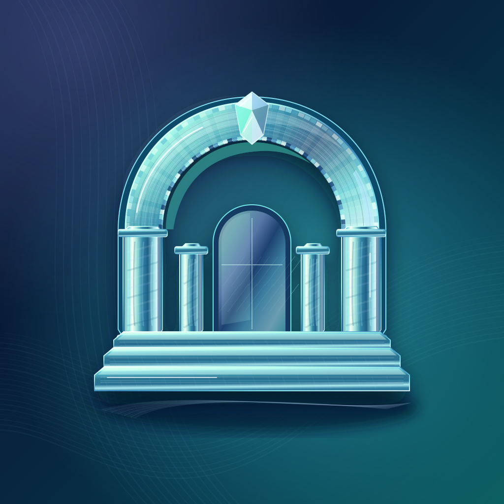
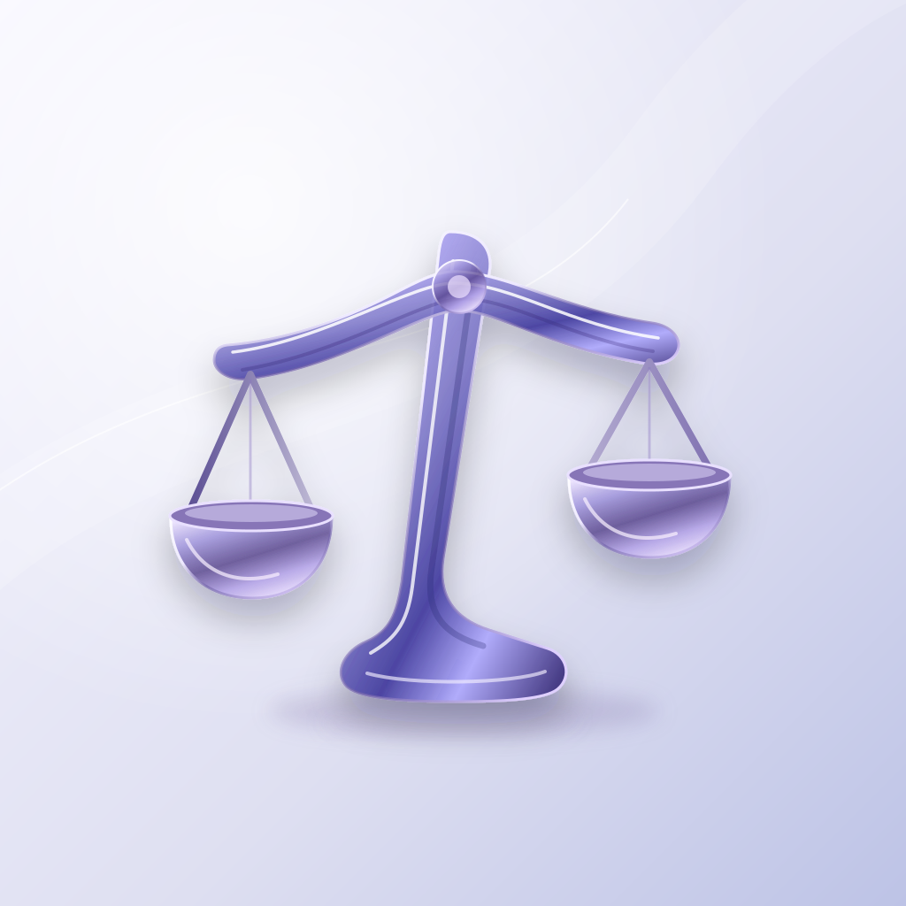
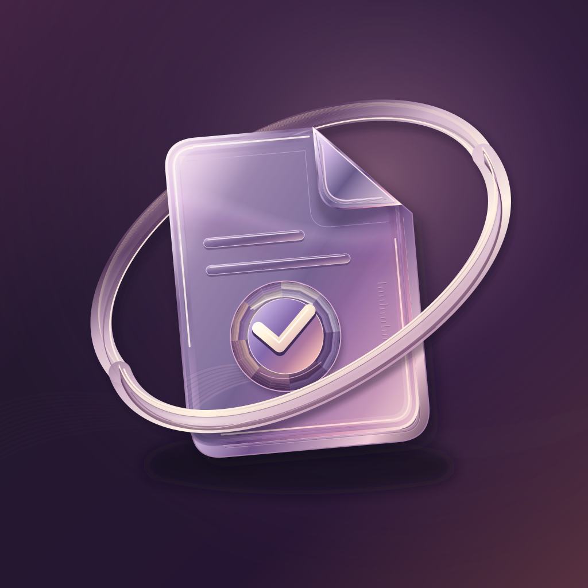
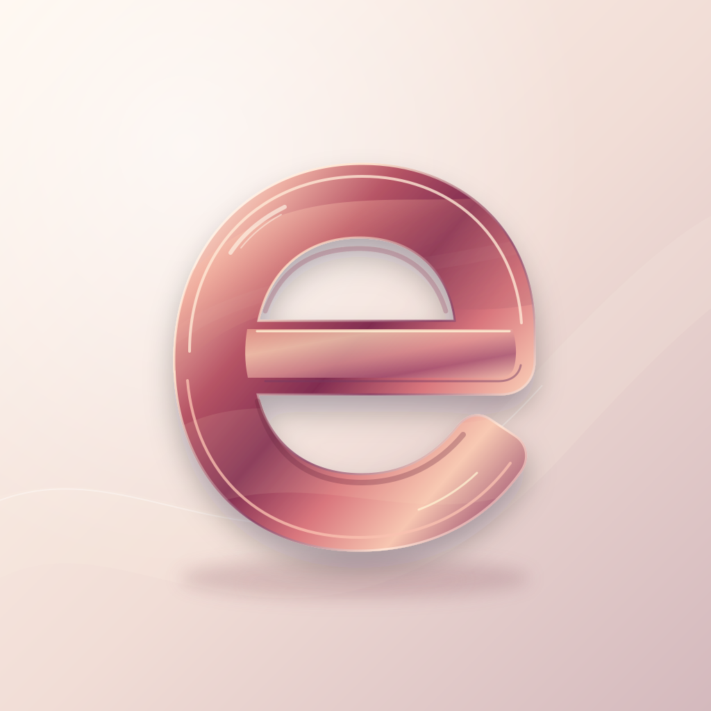
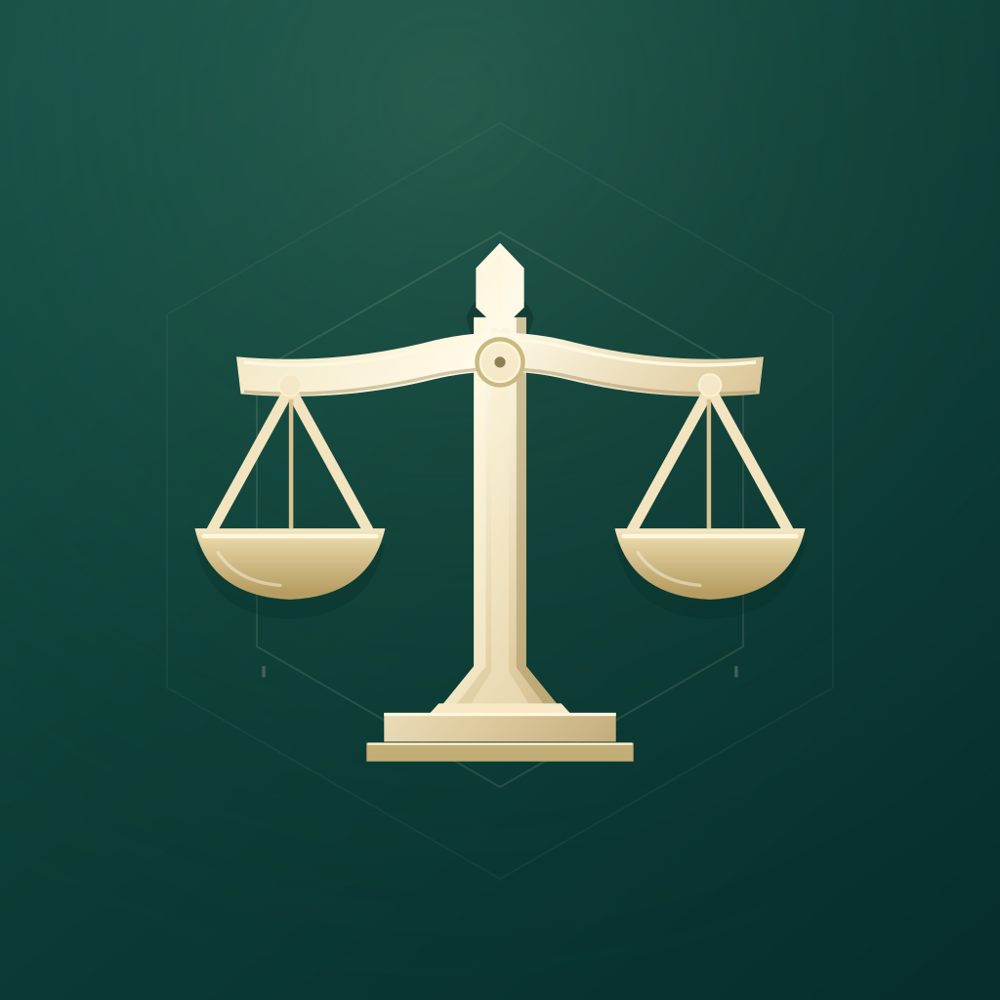
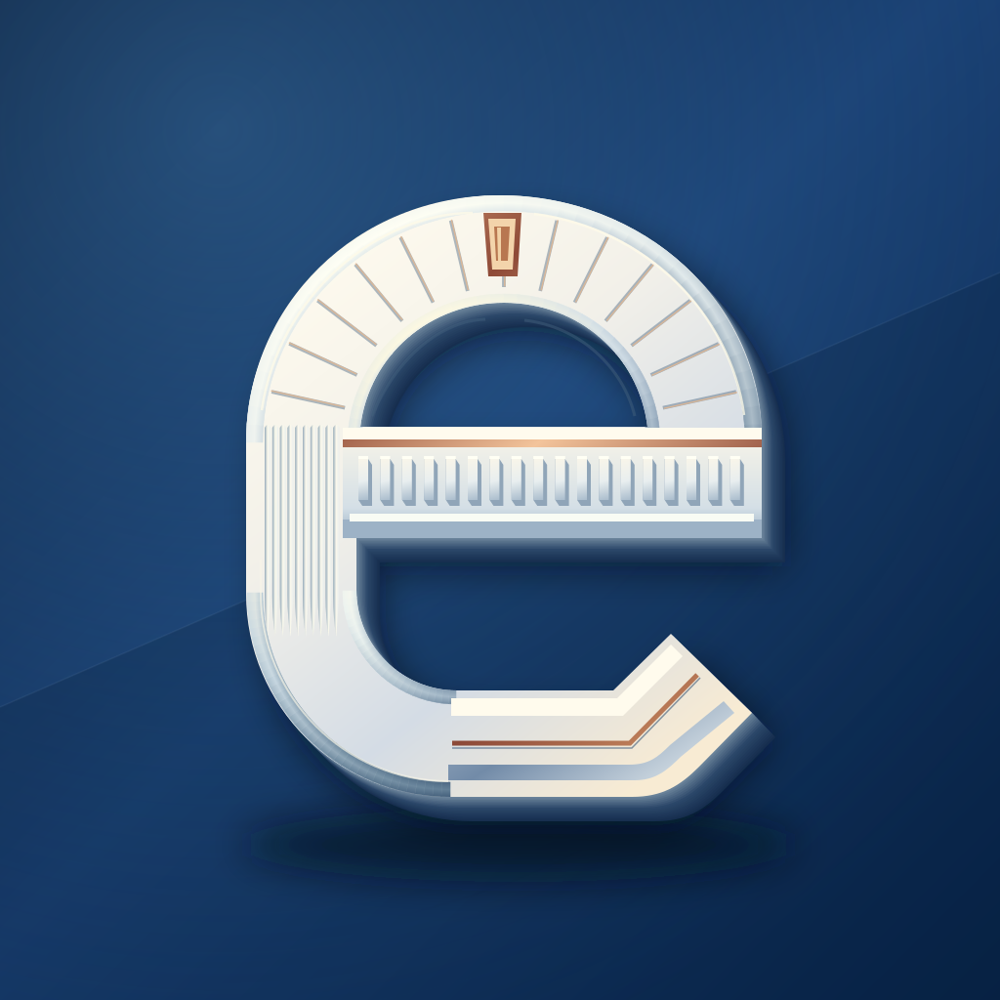

# eCourts icons

Ten standalone SVG app icons. Each uses editable vector paths, shapes and gradients with a `1024 × 1024` viewBox. No embedded images or external fonts.

## Liquid glass

| Preview | Icon | File |
| --- | --- | --- |
|  | 01 · Prism Court | [SVG](liquid-glass/icons/01-prism-court.svg) |
|  | 02 · Liquid Balance | [SVG](liquid-glass/icons/02-liquid-balance.svg) |
|  | 03 · Crystal Folio | [SVG](liquid-glass/icons/03-crystal-folio.svg) |
|  | 04 · Orbit Docket | [SVG](liquid-glass/icons/04-orbit-docket.svg) |
|  | 05 · Glass Monogram | [SVG](liquid-glass/icons/05-glass-monogram.svg) |

## Normal / main

| Preview | Icon | File |
| --- | --- | --- |
|  | 01 · Court Seal | [SVG](main/icons/01-court-seal.svg) |
|  | 02 · Casebook | [SVG](main/icons/02-casebook.svg) |
|  | 03 · Justice Mark | [SVG](main/icons/03-justice-mark.svg) |
|  | 04 · Civic Monogram | [SVG](main/icons/04-civic-monogram.svg) |
|  | 05 · Hearing Docket | [SVG](main/icons/05-hearing-docket.svg) |

The two folders hold alternative designs for the two app editions. No icon is selected as the default.

